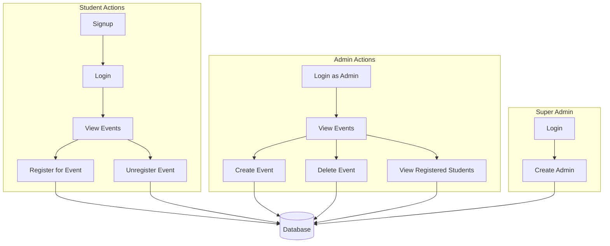

```mermaid
flowchart TD


    subgraph Student Actions
        S1[Signup] --> S2[Login]
        S2 --> S3[View Events]
        S3 --> S4[Register for Event]
        S3 --> S5[Unregister Event]
    end

    subgraph Admin Actions
        A1[Login as Admin] --> A2[View Events]
        A2 --> A3[Create Event]
        A2 --> A4[Delete Event]
        A2 --> A5[View Registered Students]
    end

    subgraph Super Admin
        SA1[Login] --> SA2[Create Admin]
    end

    S4 --> DB[(Database)]
    S5 --> DB
    A3 --> DB
    A4 --> DB
    A5 --> DB
    SA2 --> DB


```