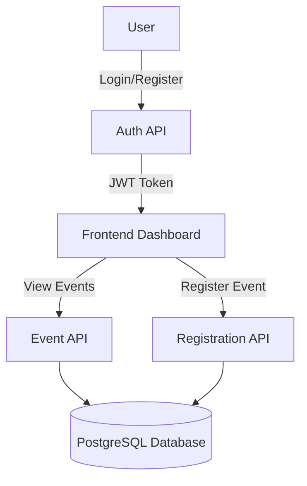

# 1. High-Level Architecture

```mermaid

flowchart TD
    A[User] -->|Login/Register| B[Auth API]
    B -->|JWT Token| C[Frontend Dashboard]
    C -->|View Events| D[Event API]
    D --> E[(PostgreSQL Database)]
    C -->|Register Event| F[Registration API]
    F --> E
```
