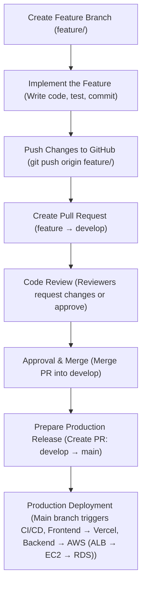

# Code Merge Workflow

## 1. Create a Feature Branch

Developers start by creating a new branch from the develop branch.

Branch naming convention:

- feature/<feature-name>

Example:

- feature/event-soft-delete

## 2. Implement the Feature

Developers write code, test locally, and commit changes with clear messages.

Example commit: `git commit -m "feat: added soft delete functionality for events"`

## 3. Push Changes to GitHub

Developers push their feature branch to the remote repository.

`git push origin feature/<feature-name>`

## 4. Create a Pull Request (PR)

A pull request is created from:

- feature/<feature-name> to develop

Developers must include a meaningful description and assign reviewers.

## 5. Code Review

Reviewers inspect the code for quality, correctness, security, and performance.  
Requested changes must be resolved, and the PR must be updated accordingly.

## 6. Approval and Merge

After approval and successful checks, the PR is merged into the develop branch.

## 7. Prepare for Production Release

When all features for the release cycle are ready, a release PR is created:

- develop to main

## 8. Production Deployment

Merging into the main branch triggers the production CI/CD pipeline:

- Frontend deploys via Vercel
- Backend deploys to AWS (ALB → EC2 → RDS)

## Code Merge Workflow Flowchart

