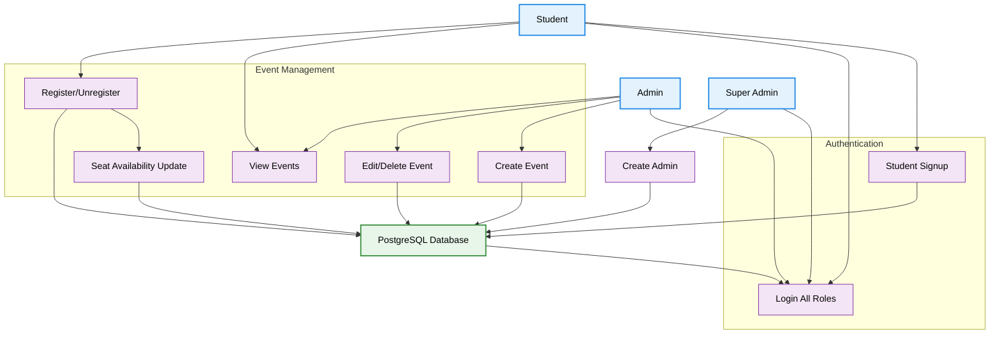

```mermaid
flowchart TD

    %% === Users ===
    ST[Student]
    AD[Admin]
    SA[Super Admin]

    %% === Auth Module ===
    subgraph Authentication
        Signup[Student Signup]
        Login[Login All Roles]
    end

    %% === Event Management ===
    subgraph Event Management
        CreateEvent[Create Event]
        EditEvent[Edit/Delete Event]
        ListEvents[View Events]
        RegisterEvent[Register/Unregister]
        SeatUpdate[Seat Availability Update]
    end

    %% === Database ===
    DB[PostgreSQL Database]


    %% === Student Flow ===
    ST --> Signup
    ST --> Login
    ST --> ListEvents
    ST --> RegisterEvent
    RegisterEvent --> SeatUpdate
    SeatUpdate --> DB
    RegisterEvent --> DB
    Signup --> DB
    DB --> Login

    %% === Admin Flow ===
    AD --> Login
    AD --> CreateEvent
    AD --> EditEvent
    AD --> ListEvents
    CreateEvent --> DB
    EditEvent --> DB

    %% === Super Admin Flow ===
    SA --> Login
    SA --> CreateAdmin[Create Admin]
    CreateAdmin --> DB

    %% Styling
    classDef users fill:#e3f2fd,stroke:#1e88e5,color:#000,stroke-width:2px;
    classDef process fill:#f3e5f5,stroke:#7b1fa2,color:#000;
    classDef storage fill:#e8f5e9,stroke:#388e3c,color:#000,stroke-width:2px;

    class ST,AD,SA users
    class Signup,Login,CreateEvent,EditEvent,ListEvents,RegisterEvent,SeatUpdate,CreateAdmin process
    class DB,S3 storage
```
