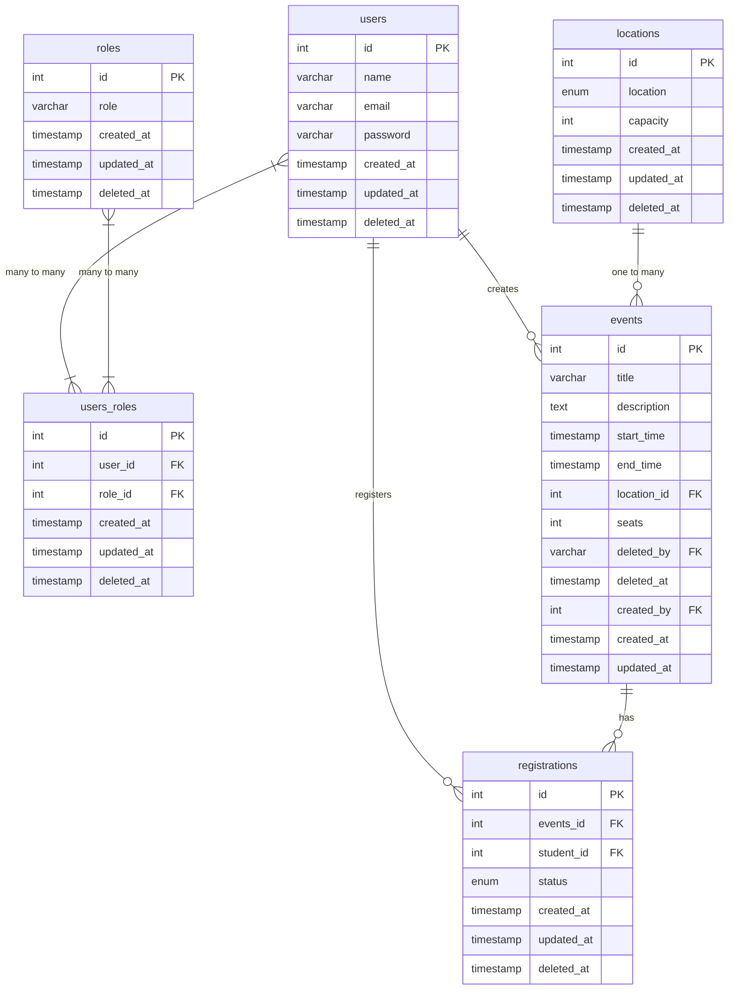

```mermaid
erDiagram
    users {
        int id PK
        varchar name
        varchar email
        varchar password
        timestamp created_at
        timestamp updated_at
        timestamp deleted_at
    }

    roles {
        int id PK
        varchar role
        timestamp created_at
        timestamp updated_at
        timestamp deleted_at
    }
    users_roles{
        int id PK
        int user_id FK
        int role_id FK
        timestamp created_at
        timestamp updated_at
        timestamp deleted_at
    }

    events {
        int id PK
        varchar title
        text description
        timestamp start_time
        timestamp end_time
        int location_id FK
        int seats
        varchar deleted_by FK
        timestamp deleted_at
        int created_by FK
        timestamp created_at
        timestamp updated_at
    }
    locations {
        int id PK
        enum location
        int  capacity
        timestamp created_at
        timestamp updated_at
        timestamp deleted_at
    }

    registrations {
        int id PK
        int events_id FK
        int student_id FK
        enum status
        timestamp created_at
        timestamp updated_at
        timestamp deleted_at
    }

    users ||--o{ events : "creates"
    users }|--|{ users_roles : "many to many"
    roles }|--|{ users_roles : "many to many"

    locations ||--o{ events : "one to many"

    users ||--o{ registrations : "registers"
    events ||--o{ registrations : "has"

```
