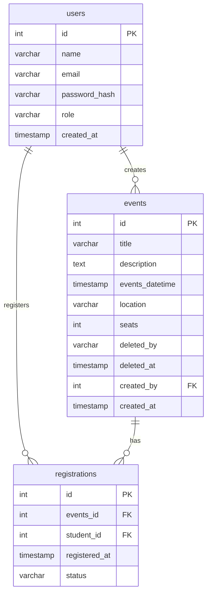

```mermaid
erDiagram

    users {
        int id PK
        varchar name
        varchar email
        varchar password_hash
        varchar role
        timestamp created_at
    }

    events {
        int id PK
        varchar title
        text description
        timestamp events_datetime
        varchar location
        int seats
        varchar deleted_by
        timestamp deleted_at
        int created_by FK
        timestamp created_at
    }

    registrations {
        int id PK
        int events_id FK
        int student_id FK
        timestamp registered_at
        varchar status
    }

    users ||--o{ events : "creates"
    users ||--o{ registrations : "registers"
    events ||--o{ registrations : "has"

```
