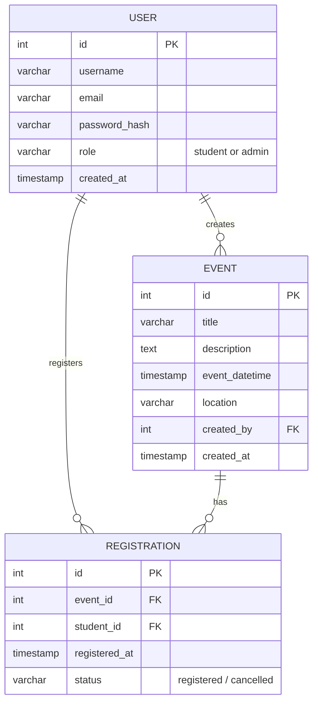

```mermaid
erDiagram
    USER {
        int id PK
        varchar username
        varchar email
        varchar password_hash
        varchar role  "student or admin"
        timestamp created_at
    }

    EVENT {
        int id PK
        varchar title
        text description
        timestamp event_datetime
        varchar location
        int created_by FK
        timestamp created_at
    }

    REGISTRATION {
        int id PK
        int event_id FK
        int student_id FK
        timestamp registered_at
        varchar status  "registered / cancelled"
    }

    %% Relationships
    USER ||--o{ EVENT : creates
    USER ||--o{ REGISTRATION : registers
    EVENT ||--o{ REGISTRATION : has
```
