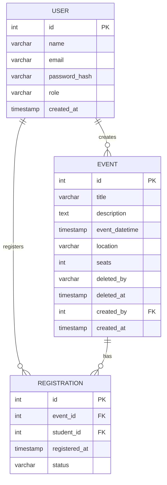

```mermaid
erDiagram

    USER {
        int id PK
        varchar name
        varchar email
        varchar password_hash
        varchar role
        timestamp created_at
    }

    EVENT {
        int id PK
        varchar title
        text description
        timestamp event_datetime
        varchar location
        int seats
        varchar deleted_by
        timestamp deleted_at
        int created_by FK
        timestamp created_at
    }

    REGISTRATION {
        int id PK
        int event_id FK
        int student_id FK
        timestamp registered_at
        varchar status
    }

    USER ||--o{ EVENT : "creates"
    USER ||--o{ REGISTRATION : "registers"
    EVENT ||--o{ REGISTRATION : "has"

```
