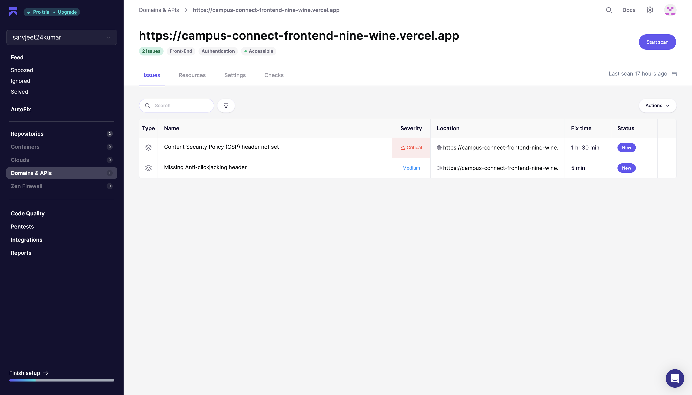

# Security Scanning (SAST and DAST)

## 1. Overview

Security scanning ensures that the application code and deployed environment are protected from vulnerabilities.  
This process includes two main types of scans:

- SAST (Static Application Security Testing)
- DAST (Dynamic Application Security Testing)

### Tools used for SAST:

- Trivy
- Aikido
- Semgrap

### Tools used for DAST:

- Aikido

---

## 2. Static Application Security Testing (SAST)

### Purpose

SAST scans the application's source code without executing it.  
It helps identify vulnerabilities such as:

- SQL injection risks
- Hardcoded secrets
- Unsafe dependencies
- Input validation issues
- Insecure configurations

## Trivy SAST Report Frontend

## Trivy SAST Report Backend

## 3. Dynamic Application Security Testing (DAST)

### Purpose

DAST scans the running application to detect runtime vulnerabilities.  
It checks for:

- Broken authentication
- Authorization bypass
- Injection flaws
- Security misconfigurations
- Exposed APIs or sensitive data

## Aikido Report

## Semgrep Report

